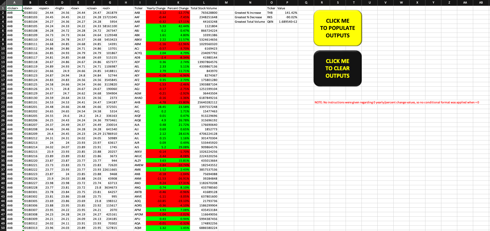
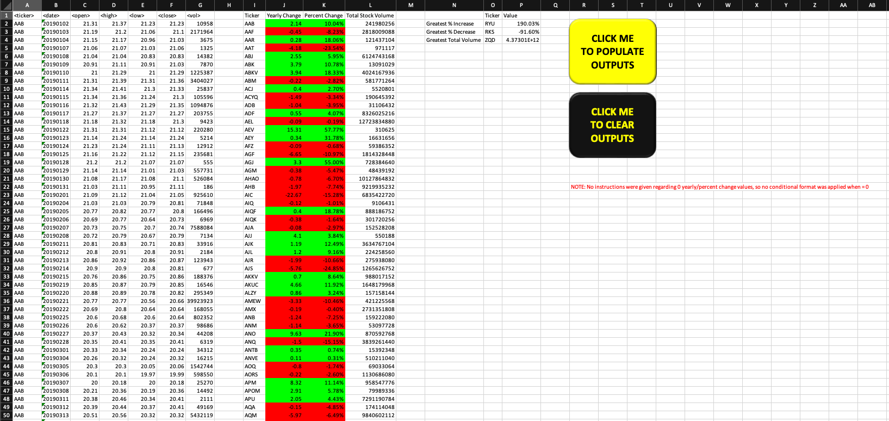
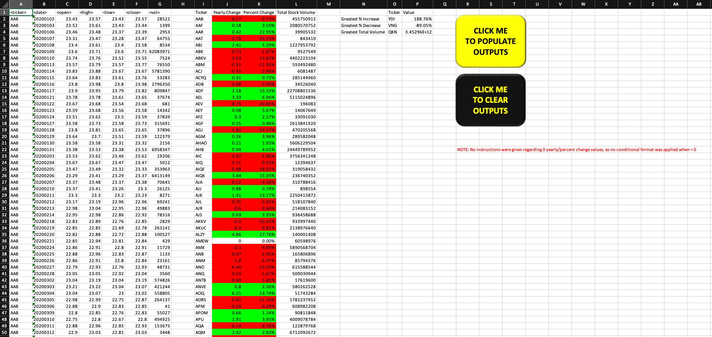
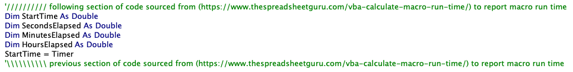
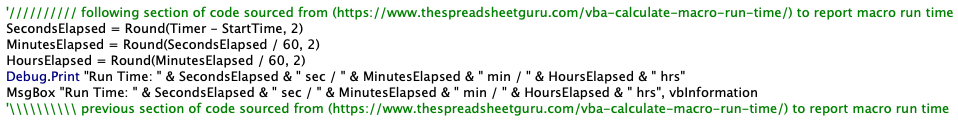

# VBA-challenge
Module 2 Challenge

Screenshot of 2018 tab:

Screenshot of 2019 tab:

Screenshot of 2020 tab:

To assist in troubleshooting some run time issues I was having, I used run time reporting code found at the following site: https://www.thespreadsheetguru.com/vba-calculate-macro-run-time/ in order to not have to sit there and watch the time myself. This is clearly identified in my code with comments where it begins and ends. At the end of the day, I commented it out these rows in the final version to speed things up further once I was done troubleshooting. You will see this code at the beginning and end of each subroutine. Screenshots below for reference.

If I need to document something like the above differently in future, please advise.

