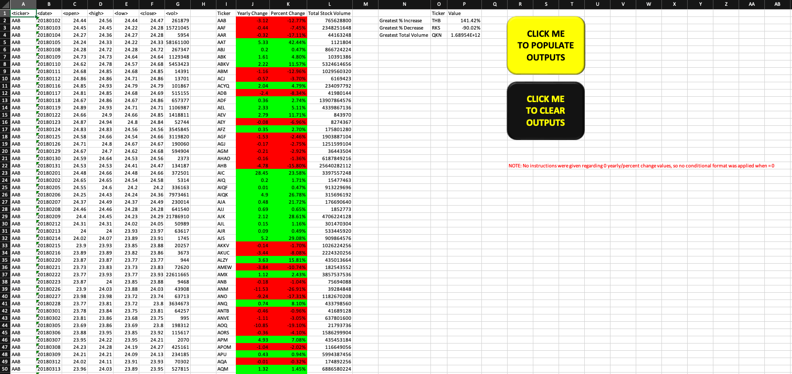
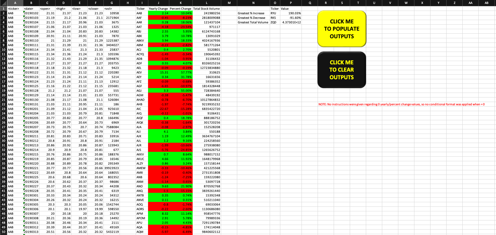
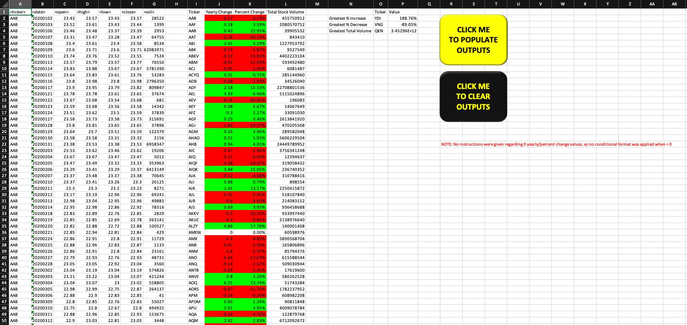
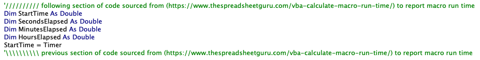
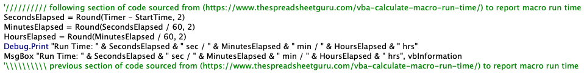

# Module 2 Challenge

## 
Background / Scenario
 
In this assignment, you will use VBA scripting to analyze generated stock market data.
 

## 
Outputs / Analysis
 
Refer to the enclosed excel file and associated VBA code. The VBA script results in the following outputs.  

<ins>Screenshot of 2018 tab with script results</ins>:   

<ins>Screenshot of 2019 tab with script results</ins>:   

<ins>Screenshot of 2020 tab with script results</ins>:   

## 
References

To assist in troubleshooting some run time issues I was having, I used run time reporting code found at the following site: https://www.thespreadsheetguru.com/vba-calculate-macro-run-time/ in order to not have to sit there and watch the time myself. This is clearly identified in my code with comments where it begins and ends. At the end of the day, I commented it out these rows in the final version to speed things up further once I was done troubleshooting. You will see this code at the beginning and end of each subroutine. Screenshots below for reference.

 
 
 

Data for this dataset was generated by edX Boot Camps LLC, and is intended for educational purposes only.  📚  
 
 
 
       
